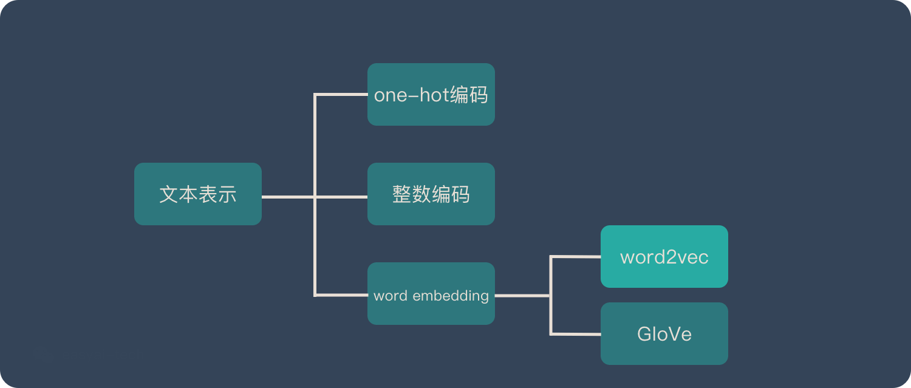
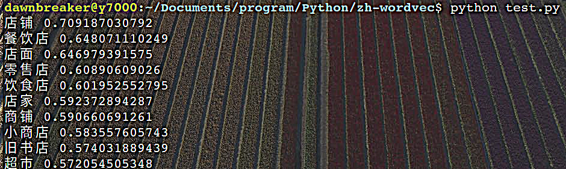
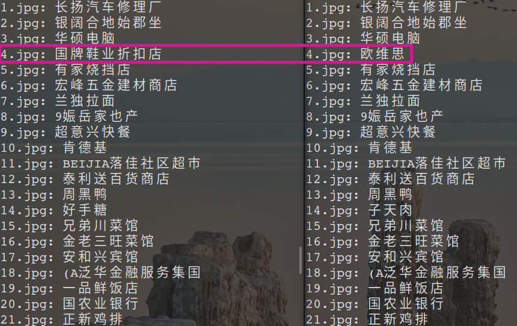

# 利用 Word2vec 模型实现街景店名提取

## Word2vec 基础知识

Word2vec，是一群用来产生词向量的相关模型。这些模型为浅而双层的[神经网络](https://baike.baidu.com/item/神经网络/16600562)，用来训练以重新建构语言学之词文本。[网络](https://baike.baidu.com/item/网络/143243)以词表现，并且需猜测相邻位置的输入词，在word2vec中词袋模型假设下，词的顺序是不重要的。训练完成之后，word2vec模型可用来映射每个词到一个向量，可用来表示词对词之间的关系，该向量为神经网络之隐藏层。

### word embedding

在说明 Word2vec 之前，需要先解释一下 Word Embedding。 它就是将「不可计算」「非结构化」的词转化为「可计算」「结构化」的向量。将现实问题转化为数学问题只是第一步，后面还需要求解这个数学问题。所以 Word Embedding 的模型本身并不重要，**重要的是生成出来的结果——词向量**。因为在后续的任务中会直接用到这个词向量。词向量具有良好的语义特性，是表示词语特征的常用方式。词向量每一维的值代表一个具有一定的语义和语法上解释的特征。所以，可以将词向量的每一维称为一个词语特征。词向量具有多种形式，distributed representation 是其中一种。一个 distributed representation 是一个稠密、低维的实值向量。distributed representation 的每一维表示词语的一个潜在特征，该特 征捕获了有用的句法和语义特性。可见 ，distributed representation 中的 distributed 一词体现了词向量这样一个特点：将词语的不同句法和语义特征分布到它的每一个维度去表示。



### Word2vec 的两种训练模式——基于相似度

#### CBOW(Continuous Bag-of-Words Model)

通过上下文来预测当前值。相当于一句话中扣掉一个词，让你猜这个词是什么。

#### Skip-gram (Continuous Skip-gram Model)

用当前词来预测上下文。相当于给你一个词，让你猜前面和后面可能出现什么词，本任务采用这种训练模式。

### 优化方法

为了提高速度，Word2vec 经常采用 2 种加速方式：

* Negative Sample（负采样）
* Hierarchical Softmax

### word2vec模型优缺点

#### 优点

*  Word2vec 会考虑上下文，跟之前的 Embedding 方法相比，效果要更好。
* 比之前的 Embedding方法维度更少，所以速度更快（模型更轻量化）
* 通用性很强，可以用在各种 NLP 任务中。

#### 缺点

* 由于词和向量是一对一的关系，所以多义词的问题无法解决。
* Word2vec 是一种静态的方式，虽然通用性强，但是无法针对特定任务做动态优化。

## 开发环境及数据准备

### 环境依赖 

* python 2.7 / ubuntu 18.04 LTS

```bash
python 2.7
pip install numpy
pip install scipy
pip install gensim
pip install jieba
```

* Opencc——一个开源的中文简繁转换项目，致力于制作高质量的基于统计预料的简繁转换词库

```bash
# clone 源码
git clone https://github.com/BYVoid/OpenCC

cd OpenCC
# 若缺少Doxygen 需要安装
sudo apt-get install doxygen

# 编译安装
sudo make
sudo make install
# 创建链接 通过find命令找到libopencc.so.2路径
find / -name libopencc.so.2 
# 设置软链接
ln -s /usr/lib/libopencc.so.2 /usr/lib64/libopencc.so.2

# 安装验证 
opencc --version

# 调用执行 configure json 采用t2s 繁体转简体
opencc -i <input file> -o <output file> -c <configure json>
```

### 数据准备处理

#### 下载

到wiki官网下载[中文语料](https://link.jianshu.com/?t=https://dumps.wikimedia.org/zhwiki/latest/zhwiki-latest-pages-articles.xml.bz2)，下载完成后会得到命名为zhwiki-latest-pages-articles.xml.bz2的文件。

#### 格式转换 xml to txt

使用到函数：gensim.corpora 因为数据集单词数量极多（上万甚至10万级别），而一篇文档的单词数是有限的，所以如果还是采用密集矩阵来表示的话，会造成极大的内存浪费，所以gensim内部是用稀疏矩阵的形式来表示的。我们利用corpora中的WikiCorpus类来处理。

```python
from gensim import corpora
from corpora import gensim
# many other lines, important part following:
wiki = WikiCorpus(intp,lemmatize=False,dictionary=[]) # wiki处理类WikiCorpus
for text in wiki.get_texts(): # 将get_texts 把每篇文章转换为一行text文本，去掉了标点符号的内容
    output.write(space.join(text)+'\n')
    i=i+1
    if (i%10000 == 0):
        print "Saved "+str(i)+" articles."
```

```bash
> python 1_process.py zhwiki-latest-pages-articles.xml.bz2 wiki.zh.txt
```

运行完成后即可得到38w篇文章，1.3GB的txt文件。

#### 简体转换

利用刚刚配置好的opencc工具，将txt文本转成简体格式。

```bash
> opencc -i wiki.zh.txt -o wiki.zh.simp.txt -c t2s.json
```

#### 编码转换

```bash
> iconv -c -t UTF-8 wiki.zh.simp.txt wiki.zh.simp.txt # 转换后直接覆盖
```

## 分词提取及Word2vec 模型训练

### 街景词提取算法

要把词向量分类，可以以已有的相似度为依据，来进行分类，不过会出先以下问题：

若A和B相似，B和C相似，但A和C并不一定相似，如果描述以两两之间 的关系，来对整个词向量空间做分类，效果是值得考究的。

如果只要word2vec生成的词向量，然后对向量本身进行分类，有按给定指标分类的，或自分类的做聚类，因为我们知道该以什么指标来进行分类——街景标牌（店名）名称，所以这里我们选择以多指标聚类的方式来都词向量进行分类，聚类算法有很多，K-means算法来对词向量进行聚类，步骤如下：

* 把文本用jieba分词。
* 分词结果用word2vec向量化。
* 用K-means聚类、相似度提取。

### jieba分词提取

采用分词对字体简化后的wiki中文语料数据集进行分词，在执行代码前需要安装jieba模块。由于此语料已经去除了标点符号，因此在分词程序中无需进行清洗操作，可直接分词。若是自己采集的数据还需进行标点符号去除和去除停用词的操作。

由于数据量大，要求精确分词，`jieba.cut()`调用时采用精确模式。

```python
# f is file variable of "wiki.zh.sim.txt"
line=f.readline()
seg_list = jieba.cut(line,cut_all=False) # line 是一篇文章
line_seg = ' '.join(seg_list)
```

### word2vec向量化模型

分好词的文档即可进行word2vec词向量模型的训练了。（这里可能需要较大的内存，可以采用多进程或虚拟内存优化）。

* 利用gensim.model的训练模型对语料txt进行训练。

```python
fdir = './'
# inp 为输入  outp1是输出模型   outp2是 原始向量vector模式的模型
inp = fdir + 'wiki.zh.simp.seg.txt'
outp1 = fdir + 'wiki.zh.text.model'
outp2 = fdir + 'wiki.zh.text.vector'
# skip-gram 模型训练
model = Word2Vec(LineSentence(inp),size=400,window=5,min_count=5,workers=multiprocessing.cpu_count())
# 模型保存
model.save(outp1)
model.wv.save_word2vec_format(outp2,binary=False)
```
训练完成后得到四个文件

* wiki.zh.text.model 建好的模型
* wiki.zh.text.vector 词向量
* wiki.zh.text.model.*.npy(2个) 是临时产生的模型文件

### 模型测试——相似度提取

首先加载模型 `model=gensim.models.Word2Vec.load(fdir+'wiki.zh.text.model')`

* 获得一个词语的最相关的词列表及相似度 `word = model.most_similar(u"相似")`
* 获得两个词语间的相似度: `s = model.similarity(u"单词1",u“单词2”)` 范围在-1到1之间

“商店”的最相似词语的测试结果如下：



### 从街景提取的图片中获取街牌名

#### 街景OCR数据载入

由街景OCR获取的txt文件格式如下：


data 载入处理：

* 利用正则表达式替换、分割。

```python
f = open("./OCRresult.txt",'r')
txt=f.read()
txt=re.sub("./test/","",txt) # 删掉多余的“test”
# txt=re.sub("\(","",txt)
# txt=re.sub("\)","",txt)
txt=re.sub("\], \d+","",txt) # 多余的[] 会影响后面的提取
txt=re.sub("\[","",txt)
txt=txt.split('\n')[:-1] # 按换行分割图片街景识别OCR结果
```

* 将结果中的文字框长、宽、汉字提取

```python
for x in txt:
    if len(x)>0 and x[-1]!='g': # 如果不是图像"*.jpg"的那一行或者空行，则包含了识别信息
        cnt=cnt+1
        x=x.split(', ')
        words=[]
        width=[]
        height=[]
        for j in x: # 按正则表达式提取出关键信息
            if j.find('text')!=-1:
                words=words+re.findall(": '(.*?)'",j,re.S)
            if j.find("'w'")!=-1:
                width=width+[float(re.findall("'w': (\d+.\d+)",j,re.S)[0])] 
            if j.find("'h'")!=-1:
                height=height+[float(re.findall("'h': (\d+.\d+)",j,re.S)[0])] 
```

#### 街牌名关键词选定，提取算法

根据大多数街景的类别，设定了以下七种街牌名标准

| 聚类名 | 店名 | 商店 | 产品 | 工厂 | 银行 | 餐饮 | 公司 |
| ------ | ---- | ---- | ---- | ---- | ---- | ---- | ---- |
| 权重   | 0.12 | 0.13 | 0.09 | 0.15 | 0.18 | 0.17 | 0.16 |

具体算法如下：

* 对于每张图识别到的每个单词{W}，先进行jieba分词{s}，对于每个分词进行以上聚类名的相似度评分 si，单词的评分为分词评分的最大值，而整张图片提取的最像街牌名的单词是单词评分最大的词。即
  $$
  \begin{aligned}
  Word_{Street~brand}=&max_{i=1}^n{Wi}\\
  Wi=&max_{j=1}^{m} si
  \end{aligned}
  $$

* 其次，对于OCR结果中给定的长和宽度，一般而言，长宽面积较大的成为街牌名的可能性较大，因此，在此NLP任务中增加面积的判别，可以使得那些非传统意义上的街牌名提取成功率增加。前后对比如下图

  

  具体判别规则为：单词si=0，且无法分割为分词，但面积是整张图中最大的，则按一定的相似度评分*面积刷新最大值，并记录当前单词。

  * 提取成功后将结果重定向输出到`name.txt`中 `python category.py >name.txt`


* 结果指标

  | 运行速度                             | 参考环境                | 测试数量 | 平均运行时间 | 正确率 |
  | ------------------------------------ | ----------------------- | -------- | ------------ | ------ |
  | 0.813s(loading model)+5.14s(50 张图) | ubuntu 18.04 Python 2.7 | 50       | 0.12s/张     | 92%    |

## 参考资料

* [A Beginner's Guide to Word2Vec and Neural Word Embeddings](https://wiki.pathmind.com/word2vec)
* [Python | Word Embedding using Word2Vec](https://www.geeksforgeeks.org/python-word-embedding-using-word2vec[
  ](https://cn.bing.com/search?q=word2vec+python&FORM=QSRE5#)[)
* [Word2Vec 百度百科](https://baike.baidu.com/item/Word2vec/22660840)
* [Word2Vec WIKI](https://zh.wikipedia.org/wiki/Word2vec)


