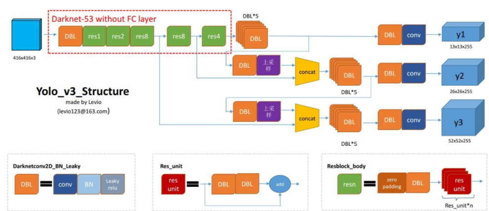
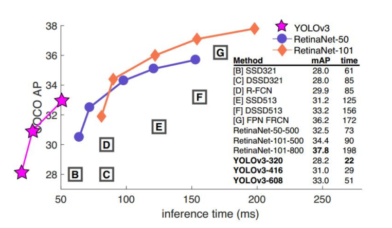

# YOLOv3 + CRNN模型实现街景文字检测与识别


## 文字位置检测模型

在图片输入后，第一部分的工作是对图片中文字所在的位置进行检测。文字检测部分我们利用目标检测框架对输入图片中文字所在的位置进行检测，并用一个可倾斜的矩形框对其进行选定，从得到图片中不同文字所在的位置。

### yolov3的网络结构

如图为YOLOv3的主要网络结构。





### YOLOv3 的优点--选择的原因

​	YOLOv3的主要优点就是 "速度快"。通过下面这张图，我们可以直观的感受到YOLOv3的速度到底有多快：



​	可以看到，YOLOv3在各种目标检测方案里面有着显著的速度优势, 而这也是我们选择YOLOv3的一个重要原因。由于我们认为街景目标中我们需要识别的商店名称是属于比较大的目标，所以在目标检测框架的精度足够的情况下，我们可以尽量提高模型的运行速度，因此我们最终选择了YOLOv3。

#### 

### 文字检测模型的部分改动

* 在实际情况下，单行文字作为目标一般不会是完全水平的，这也导致了在目标检测之后送入文字识别模块的图片截取不够精确。为了解决这一问题，我们使用了倾斜的矩形框作为目标来代替完全水平的矩形框，在训练集的标注里面加入了angle（矩形框倾斜角度）这一新的标准，从而更加准确地得到文字所在的位置。提高了文字位置检测的精度，同时也为后续进行文字检测提供了更好的预处理图片。具体标注形式改变如图所示：

  

  

* 增加检测框左右延伸一定倍数机制。

## 训练环境及数据准备

### 环境依赖 

* python 3.6 / ubuntu 18.04 
* 相关环境依赖安装命令

```bash
pip install easydict opencv-contrib-python==4.0.0.21 Cython h5py lmdb mahotas pandas requests bs4 matplotlib lxml
pip install -U pillow 
pip install keras==2.1.5 tensorflow==1.8 tensorflow-gpu==1.8
```

* 载入训练源码

```bash
git clone https://github.com/chineseocr/chineseocr.git
```

### 训练数据预处理

#### 数据集标注工具

来源 https://github.com/cgvict/roLabelImg

一个带有倾斜角度的矩形标注工具。

- python 3.6 / Windows 10
- 环境配置

```cmd
Download and setup Python 2.6 or later, PyQt4 and install lxml.

Open cmd and go to roLabelImg directory

pyrcc4 -o resources.py resources.qrc
python roLabelImg.py
python roLabelImg.py [IMAGE_PATH] [PRE-DEFINED CLASS FILE]

```

- 具体使用说明见  https://github.com/cgvict/roLabelImg

#### 开源街景商铺数据集

数据集来源 https://github.com/chongshengzhang/shopsign

对数据集的图片进行筛选，从中选择了900张图片作为我们所要使用的数据。在数据集给出的标注文件上面进行预处理，计算矩阵倾斜角度，转换成训练所需要的的xml文件格式。同时对于小部分图片进行重新标注。

##### 格式转换

由于开源数据集的标注给出了边框点的坐标位置。编写如下脚本，根据坐标进行矩阵倾斜角度从而将其转换为我们所需要的训练格式。

```python
# 展示那段格式转换的脚本逻辑
```

运行后完成数据预处理部分的工作。

### 训练方案以及过程

#### 迁移学习

考虑到我们的训练样本只有不到一千张，对于文字检测这种特征相关不是非常明显目标，如果从头开始训练很难避免出现过拟合的现象。这样也会使我们的模型没有太好的鲁棒性。为了提高文字检测模型在小样本训练上的表现，我们决定采用迁移学习的方案。

迁移学习是一种机器学习方法，就是把为任务 A 开发的模型作为初始点，重新使用在为任务 B 开发模型的过程中。我们计划采用一个较为成熟的文字检测预训练模型，在训练初期加载其权重后进行少量训练，对模型参数进行微调，使之更加符合一个街景文字检测的情况。预训练模型来源：https://github.com/chineseocr/chineseocr

#### anchors

yolov3模型的检测精度很大一部分上取决于所使用的anchors。为了提高模型在特定场景下面的检测精度，我们利用**k-mean聚类分析**在数据集进行聚类分析，得到了适用于商铺街景场景下文字检测的anchors，并在后续的训练以及测试中使用更新后的anchors。


#### 训练过程

训练环境：tensorflow_gpu1.14 / cuda 10.0


将数据集按照8：2分成训练集以及验证集。每20个epoch保存一次模型，利用tensorboard观察损失值。具体效果结合文字识别模型进行测试。

（这部分可能得补充一些）


### 模型效果展示

对模型的部分参数进行微调，并将最终检测框向两边略微延伸（主要是为了避免在文字识别部分出现漏识别的情况）


## 文字识别模型

第二部分的工作是对位置检测后得到的行文本进行文字识别工作。文字识别部分我们利用CRNN模型对文字进行识别，将图片信息转换成文本信息后依次输出。

### CRNN的网络结构

CRNN的网络结构如下图所示：


### CRNN的优点

（1）它是端对端训练的。

（2）它自然地处理任意长度的序列，不涉及字符分割或水平尺度归一化。

（3）它不仅限于任何预定义的词汇，并且在无词典和基于词典的场景文本识别任务中都取得了显著的表现。

（4）它产生了一个有效而小得多的模型，这对我们提高模型的速度有所帮助。


### 环境依赖

```bash
pip install easydict opencv-contrib-python==4.0.0.21 Cython h5py lmdb mahotas pandas requests bs4 matplotlib lxml 
pip install -U pillow
pip install keras==2.1.5 tensorflow==1.8 tensorflow-gpu==1.8
pip install web.py==0.40.dev0 redis conda install pytorch torchvision -c pytorch

```


### 模型测试

该模块使用的是开源模型，经过测试该模型在自然场景下有着相当优异的表现。

【图】


## 文字位置检测 + 文字识别

### 模型效果

在组委会提供的测试集上进行测试，输入提供图片，输出文字位置信息以及识别后结果，以json格式保存，送至第三部分店铺名称检测进行处理。部分输出结果如图所示：

 

运行速度：

参考环境：

测试数量：

平均运行时间：


### 参考资料

- [迁移学习-百度百科](https://baike.baidu.com/item/迁移学习/22768151?fr=aladdin)
- https://blog.csdn.net/kk123k/article/details/86696354?utm_medium=distribute.pc_relevant.none-task-blog-BlogCommendFromMachineLearnPai2-3.add_param_isCf&depth_1-utm_source=distribute.pc_relevant.none-task-blog-BlogCommendFromMachineLearnPai2-3.add_param_isCf
- Shi B , Bai X , Yao C . An End-to-End Trainable Neural Network for Image-Based Sequence Recognition and Its Application to Scene Text Recognition[J]. IEEE Transactions on Pattern Analysis and Machine Intelligence, 2017.
- Redmon J , Farhadi A . YOLOv3: An Incremental Improvement[J]. arXiv e-prints, 2018.
- Chongsheng Zhang, Guowen Peng, Yuefeng Tao, Feifei Fu, Wei Jiang, George Almpanidis, Ke Chen: ShopSign: a Diverse Scene Text Dataset of Chinese Shop Signs in Street Views. arXiv，2019.
- https://github.com/chineseocr/chineseocr
- https://github.com/chongshengzhang/shopsign


